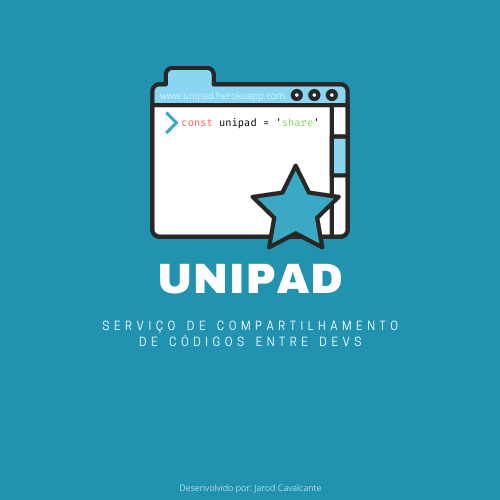

#  Unipad

O [unipad](https://unipad.herokuapp.com/) é um serviço para compartilhamento de códigos de forma simples, inspirado no [dontpad](http://dontpad.com/). Nele você cria uma URL para o seu bloco de código, que, sucessivamente você pode colocar o que quiser, desde que seja em texto e formata-lo de acordo com a extenção do seu arquivo/código. Exemplo: o trexo de código que você vai compartilhar/colocar no pad é um código em javascript, logo, a extenção para formatação deverá ser javascript.

### Diferenças entre o Unipad e o Dontpad
| Ação | Dontpad | Unipad|
|--|--| --|
|Pode proteger a URL com senha | Não | Sim  |
|Pode definir uma data para expiração da URL|Não| Sim
|Formata o conteúdo de acordo com o formato do arquivo|Não| Sim

---
### Desenvolvimento
#### Backend
- *express* para o servidor web
- *Mongoose* para conexão com o MongoDB
- *Nodemon* para atualizar em tempo real

#### Frontend
- *ReactJs*
- *Axios* para conexão com a API
- Biblioteca *crypto* para criptografar as senhas
- *prismjs* para colorir o código de acordo com o formato do mesmo (simular uma IDE)
- *styled-componnets* para adicinar estilo aos componentes
- *react-copy-to-clipboard* para função de copiar o código digitado e compartilhar a url
- *material-ui* para estilização e uso de componetes como inputs, inputs de data e menu
#### Hospedagem
Ambos frontend e backend estão hospedados no [Heroku](https://heroku.com/)  

#### Banco de Dados
O banco de dados utilizado é o MongoDb. Utilizo a versão free (512mb) do MongoLab.

### 🚀Como rodar em sua máquina
- Baixe ou fork esse projeto
- Baixe ou fork o [backend](https://github.com/jarodsim/unipad-backend) 
- No frontend, altere o arquivo "api.js" mudando o baseURL para> `baseURL:  "http://localhost:4000/pad"`
- Cria um banco de dados local no mongoDB com o nome de `unipad`
- No backend e no frontend rode o comando `yarn install` ou `yarn` para baixar as dependências
- Em seguida inicie o backend com o comando `yarn dev` 
 - No frontend rode o comando `yarn start` para iniciar a aplicação que estará rodando em `Localhost:3000`

© Jarod Cavalcante - 2020
