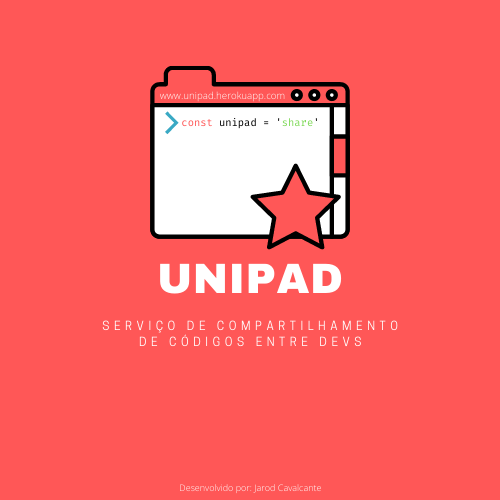

# Unipad

O [unipad](https://unipad.herokuapp.com/) é um serviço para compartilhamento de códigos de forma simples, inspirado no [dontpad](http://dontpad.com/). Nele você cria uma URL para o seu bloco de código, que, sucessivamente você pode colocar o que quiser, desde que seja em texto e formata-lo de acordo com a extenção do seu arquivo/código. Exemplo: o trexo de código que você vai compartilhar/colocar no pad é um código em javascript, logo, a extenção para formatação poderá (o usuário quem escolhe) ser javascript.

### Diferenças entre o Unipad e o Dontpad

| Ação                                                  | Dontpad | Unipad   |
| ----------------------------------------------------- | ------- | -------- |
| Pode proteger a URL com senha                         | Não     | Sim      |
| Pode definir uma data para expiração da URL           | Não     | Sim      |
| Formata o conteúdo de acordo com o formato do arquivo | Não     | Sim      |
| Playground para a linguagem Javascript                | Não     | Em breve |
| Digitação com amigos em tempo real                    | Não     | Sim      |

---

### Desenvolvimento

#### Backend

- _express_ para o servidor web
- _Mongoose_ para conexão com o MongoDB
- _Nodemon_ para atualizar em tempo real
- _Crypto_ para hash e salta de senhas
- _Socket IO_ Para digitação em tempo real com amigos

#### Frontend

- _ReactJs_
- _Axios_ para conexão com a API
- _prismjs_ para colorir o código de acordo com o formato do mesmo (simular uma IDE)
- _styled-componnets_ para adicinar estilo aos componentes
- _react-copy-to-clipboard_ para função de copiar o código digitado e compartilhar a url
- _material-ui_ para estilização e uso de componetes como inputs, inputs de data e menu
- _Socket IO Client_ Para digitação em tempo real com amigos

#### Hospedagem

Frontend hospedado na [Versel](https://vercel.com/)
Backend hospedado na [Render](https://render.com/)

#### Banco de Dados

O banco de dados utilizado é o MongoDb. Utilizo a versão free (512mb) do MongoAtlas.

### 🚀Como rodar em sua máquina

- Baixe ou fork esse projeto
- Baixe ou fork o [backend](https://github.com/jarodsim/unipad-backend)
- No frontend, altere o arquivo "api.js" mudando o baseURL para> `baseURL: "http://localhost:4000"`
- Cria um banco de dados local no mongoDB com o nome de `unipad`
- No backend e no frontend rode o comando `yarn install` ou `yarn` para baixar as dependências
- Em seguida inicie o backend com o comando `yarn dev`
- No frontend rode o comando `yarn start` para iniciar a aplicação que estará rodando em `Localhost:3000`

© Jarod Cavalcante - 2023
